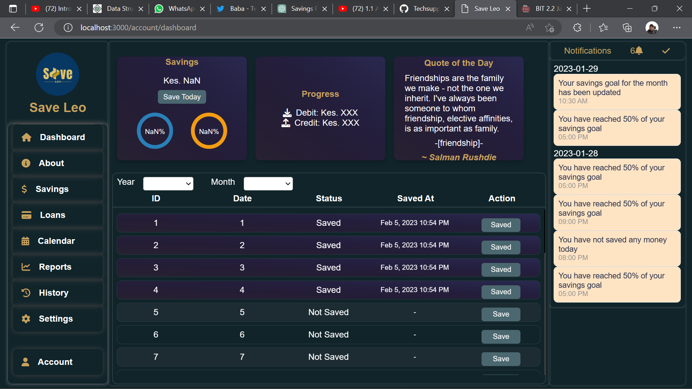

# Savings Plan App

<!-- screenshot -->


<p>A React Js Web Application that enables registered users to track their savings by marking an amount saved each day. The app is divided into three sections, the sidebar, rightbar, and the maindash. The sidebar has menu items including Dashboard which has three sections too: the top, middle and bottom section. The top section has 3 cards - savings card, save card, and quotes card which fetches quotes from an API.</p>

## Features

<h4>Users can save a specified amount each day</h4>

<ul>
<li>The app displays two circular progress bars for the current month and year</li>
<li>The app includes a form for users to fill out loan details whether they are a debit or a credit</li>
<li>The app includes a savings table to keep track of savings made</li>
<li>The app includes a notification section to keep track of all notifications</li>
<li>The app includes a settings section to change the app theme</li>
<li>The app includes a logout section to log out of the app</li>
</ul>

## Technologies

<ul>
<li>React Js</li>
<li>React Router</li>
<li>React Hooks</li>
<li>React Context</li>
<li>React Bootstrap</li>
<li>React Icons</li>
<li>React Toastify</li>
<li>React Router</li>
<li>React Router Dom</li>
<li>React Router Bootstrap</li>
<li>React Router Hash Link</li>
<li>React ant design</li>
<li>React Chart JS</li>
</ul>

## Installation

<h4>Clone the repository</h4>

```bash
git clone
```

<h4>Install dependencies</h4>

```bash
npm install
```

<h4>Run the app</h4>

```bash
npm start
```

## License

[MIT](https://choosealicense.com/licenses/mit/)

## Author

[Victor Quaint](

## Acknowledgements

<ul>
<li>React Js</li>
<li>React Router</li>
<li>React Hooks</li>
<li>React Context</li>

## Screenshots

 licensed.
